I have been living in the UK since 2010 when I started my degree. My family lives in India and I visit them once every
year. Since all of my income and most of my financial assets are based in the
UK, I had not previously looked into tax liabilities for any income/assets in
India. Recently, I have been wondering whether I should move some of my assets
to India. Is there any financial benefit to doing so? This prompted me to deep dive into the tax implications of keeping assets in India.

<Alert severity="warning">
 This is not financial advice. I'm just a normal person googling to understand a fairly complex topic. Therefore, what I'm sharing with you may be incorrect. I have also omitted a lot of detail and edge cases to keep it simple and digestible. However, I have provided links to all my sources so that you can explore further on your own.

Please do your own research or consult a financial advisor if appropriate for
your use case. If you do spot any mistakes, please do let me know in the
comments.

</Alert>

## Table of contents

## Tax wrappers in the UK: Tuck away up to £80,000 of income per year

Although the focus of this article will be income and assets in India, it's
worth having a baseline in mind to compare to - i.e. tax liabilities on the UK
income/assets to the UK government.

The typical employed UK resident saves for their retirement in a
[workplace pension](https://www.gov.uk/workplace-pensions) and pays
[income tax through PAYE](https://www.gov.uk/income-tax/how-you-pay-income-tax).
They can defer tax on up to £60,000 in the pension. They can protect investments
from capital gains or dividend income tax in the
[Individual Savings Account [ISA]](https://www.gov.uk/individual-savings-accounts)
where, in the 2024-2025 tax year, the maximum you can save is £20,000 per year.

<Figure
 src="/blog/tax-guide-for-uk-based-nris/assets/pension-isa.svg"
 size="m"
 caption="ISA vs. pension allowance"
 reference="Skipton building society"
 referenceHref="https://www.skipton.co.uk/life-and-money/pension-or-isa"
/>

These are generous tax wrappers that incentivise the UK resident to save for the
future albeit as long as they keep their assets in the UK. Outside the tax
wrappers, there is a paltry Capital Gains tax-free allowance of £3000. Any gains
over that will be taxed. See
[gov.uk - Capital Gains Tax: what you pay it on, rates and allowances](https://www.gov.uk/capital-gains-tax/rates).

## Tax liability in India for NRIs

### Non-Resident Indians [NRIs] are not allowed to hold regular savings accounts, only NRO or NRE accounts

The [Reserve Bank of India [RBI]](https://www.rbi.org.in/home.aspx) is India's
central bank and regulatory body responsible for the regulation of the Indian
banking system - equivalent to the UK's
[Bank of England](https://www.bankofengland.co.uk/). The
[Foreign Exchange Management Act [FEMA]](https://www.indiacode.nic.in/handle/123456789/1988?view_type=browse)
is a set of rules regarding foreign money administered by RBI
[[Vance - FEMA](https://www.vance.tech/blog/understanding-fema-complete-guide-to-indias-foreign-exchange-management)].

FEMA sets out rules that impact Indians resident in other countries or
Non-Resident Indians [NRI]. NRIs are not allowed to hold regular savings
accounts in India. When you become an NRI, you must convert any existing bank
accounts to Non-Resident Ordinary [NRO] accounts. You can also open Non-Resident
External [NRE] accounts.

[FEMA section 13](https://www.indiacode.nic.in/show-data?abv=CEN&statehandle=123456789/1362&actid=AC_CEN_2_45_00004_199942_1517807323986&sectionId=4531&sectionno=13&orderno=13&orgactid=AC_CEN_2_45_00004_199942_1517807323986)
says that the penalty for breaking a rule could be:

> up to thrice the sum involved in such contravention where such amount is
> quantifiable, or up to two lakh rupees where the amount is not quantifiable,
> and where such contravention is a continuing one, further penalty which may
> extend to five thousand rupees for every day after the first day during which
> the contravention continues.

### Comparison of NRO and NRE accounts

<ComparisonTable
 columnHeaders={[
 {
   name: 'NRE',
   description: 'Non-Resident (External) Rupee Account Scheme'
 },
 {
   name: 'NRO',
   description: 'Non-Resident Ordinary Rupee Account Scheme'
 }
 ]}
 rowHeaders={[
 {
   name: 'Transfer into account'
 },
 {
   name: 'Transfer out of account'
 },
 {
   name: 'Tax liability in India'
 },
 {
   name: 'Investing'
 }
 ]}
 rows={[
 [
 {
    content: `Deposit foreign income only as INR`,
    status: 'neutral'
 },
 {
    content: 'Deposit foreign and Indian income as INR',
    status: 'good'
 }
 ],
 [
 {
    content: (
 <Typography variant="inherit">
 Funds may be transferred back to the country of residence (also known as{' '}
 <Link href="https://dictionary.cambridge.org/dictionary/english/repatriation">
 repatriation
 </Link>
 )
 </Typography>
 ),
    status: 'good'
 },
 {
    content: (
 <>
 <Typography variant="inherit" gutterBottom>
 Current income (e.g. rent, dividends, interest) are freely repatriable.
 Capital funds are subject to a USD 1 million limit and require tax compliance
 documentation.
 </Typography>
 <Typography variant="inherit">
 See{' '}
 <Link href="https://www.icicibank.com/nri-banking/nriedge/nri-articles/decoding-nre-nro-and-fcnr-accounts-for-non-resident-indians">
 ICICI Bank - Decoding NRE, NRO and FCNR accounts for NRIs
 </Link>
 </Typography>
 </>
 ),
    status: 'bad'
 }
 ],
 [
 {
    content: 'Interest not subject to tax',
    status: 'good'
 },
 {
    content:
     'Interest subject to TDS at 30% plus applicable surcharge and cess',
    status: 'bad'
 }
 ],
 [
 {
    content: (
 <Typography variant="inherit">
 Requires PIS account as described in the next section. Direct mutual fund
 investments are not available.
 </Typography>
 ),
    status: 'bad'
 },
 {
    content: (
 <>
 <Typography variant="inherit" gutterBottom>
 PIS account not required.
 </Typography>
 </>
 ),
    status: 'good'
 }
 ]
 ]}
/>

### To invest NRIs need a Demat account linked to a NRE PIS account or a NRO account

To invest, you need a `Demat` account (an account that holds shares and
securities in an electronic format). This could be with your bank itself or a
stock broker such as [Zerodha](https://zerodha.com). If you decide to use
Zerodha, I'd appreciate you using my
[Zerodha - referral](https://zerodha.com/?c=DXK651&s=CONSOLE).

Previously, NRIs could only invest in Indian companies via a Portfolio
Investment Scheme [PIS] bank account - think of this as a `special` NRO or NRE
account. However, a much simpler non-PIS route was introduced more recently
which can be used with a regular NRO account. See
[Zerodha: What is the difference between a PIS and a NON-PIS account?](https://support.zerodha.com/category/account-opening/nri-account-opening/pis-non-pis/articles/difference-between-pis-and-non-pis)
for more details.

The diagram below shows the money flow between Indian NRE and NRO accounts. Note
that tax is deducted at source, i.e., by the bank/broker in either case.

```mermaid
---
title: Money flow b/w NRE, NRO accounts
---
flowchart TB

 subgraph SOURCES[Sources]
 INDIA_INCOME[🇮🇳 Income in India]
 UK[🇬🇧 Foreign bank account]
 end

 subgraph INDIA_BANK[Indian bank accounts]
 NRO[NRO bank account]
 NRE[NRE bank account]
 NRE_PIS[NRE-PIS bank account]
 UK <--> |Freely repatriable| NRE
 UK --> NRO
 INDIA_INCOME --> NRO
 NRE --> NRO
 end

 DEMAT_NRE[NRE-PIS linked Demat account]
 DEMAT_NRO[NRO linked Demat account]

 NRE --> NRE_PIS
 NRE_PIS --> |Funds| DEMAT_NRE
 DEMAT_NRE --> |Sale proceeds after tax| NRE_PIS
 DEMAT_NRE --> |Dividends after tax| NRE

 NRO --> |Funds| DEMAT_NRO
 DEMAT_NRO --> |Sale proceeds/dividends after tax|NRO
```

### NRIs have to pay income tax in India for any income in India

Income tax in India is complex as you can imagine. ICICI bank has a good
article
[NRI taxation: Know the income tax rates](https://www.icicibank.com/nri-banking/nriedge/nri-articles/nri-taxation-know-the-income-tax-rates)
with some examples. Or you might prefer the more authoritative source -
[incometax.gov.in](https://www.incometax.gov.in/iec/foportal/help/individual/return-applicable-0).

Key takeaways:

1. You have to pay tax if your level of income is higher than ₹3 lakh.
2. Income tax slabs are the same for residents and NRIs. The total tax liability
 is the sum of:
   - Income tax depending on your level of income
   - Surcharge - an additional tax levied on your base income tax when your
 taxable income crosses ₹50 lakh
   - Health and education cess of 4% on the sum of income tax and surcharge
3. However, note that the Tax Deducted at Source (TDS), for example by your bank
 or stock broker, will be a fixed percentage - higher than your tax liability
 according to the slab rates. You have to file an Income Tax Return (ITR) if
 you want to claim back any excess tax paid. More on this in the next section.

You can see how the income tax varies in the graph below.

<Iframe src="//plotly.com/~bluprince13/46.embed" />

### NRIs may have to submit Income Tax Returns (ITR) in India

If your total annual income in India exceeds ₹3 lakh, then you're mandated to
file an Income Tax Return (ITR). Fortunately, if your income only consists of
investment income (e.g. dividends/interest) or long-term capital gains where
you've already paid TDS based on the special tax provisions for NRIs,
then you don't have to file ITR. For more details, see
[ICICI - When is it mandatory for an NRI to file an ITR in India?](https://www.icicibank.com/nri-banking/nriedge/nri-articles/does-an-nri-need-to-file-itr-in-india).

However, you can file an ITR and opt out of the special tax provisions and pay
taxes according to the slab rate. This might be beneficial if you'd pay less tax
that way. For example, you'd pay no tax at all if the investment income is less
than ₹3 lakh. For more details see
[ICICI - Understanding Special Tax Provisions for NRIs](https://www.icicibank.com/nri-banking/nriedge/nri-articles/special-provisions).

You can also claim reduced tax based on the
[Double Taxation Avoidance Agreement [DTAA] b/w UK and India](https://www.gov.uk/hmrc-internal-manuals/double-taxation-relief/dt9550pp).
I would not recommend reading the
[full treaty](https://www.gov.uk/government/publications/india-tax-treaties/2020-uk-india-synthesised-text-of-the-multilateral-instrument-and-the-1993-double-taxation-convention-in-force).
However, you can look at the
[India: Treaty summary](https://www.gov.uk/hmrc-internal-manuals/double-taxation-relief/dt9552)
and
[India: Notes](https://www.gov.uk/hmrc-internal-manuals/double-taxation-relief/dt9553).

In the below table, we compare the tax rates for:

1. TDS
   - [Cleartax - Section 195 of Income Tax Act - TDS Applicability for NRI](https://cleartax.in/s/section-195)
   - [ICICI - New TDS guidelines](https://www.icicibank.com/nri-banking/new-tds-guidelines)
   - [Zerodha - How does Zerodha deduct TDS for NRI NON-PIS accounts?](https://support.zerodha.com/category/account-opening/nri-account-opening/oq-nri/articles/tds-calculation-non-pis)
2. India-UK DTAA
   - [India: Treaty summary](https://www.gov.uk/hmrc-internal-manuals/double-taxation-relief/dt9552)

<ComparisonTable
 columnHeaders={[
 {
   name: 'TDS',
   description: 'Tax Deducted at Source'
 },
 {
   name: 'India-UK DTAA',
   description:
    'You could apply for reduced TDS or claim a tax refund per DTAA if you choose to'
 }
 ]}
 rowHeaders={[
 {
   name: 'Investment income (dividends)'
 },
 {
   name: 'Interest in NRO'
 },
 {
   name: 'Long Term Capital Gain'
 },
 {
   name: 'Short-Term Captial Gain'
 }
 ]}
 rows={[
 [
 {
    content: '20% + surcharge + cess',
    status: 'bad'
 },
 {
    content: '10%',
    status: 'good'
 }
 ],
 [
 {
    content: '30% + surcharge + cess',
    status: 'bad'
 },
 {
    content: '15%',
    status: 'good'
 }
 ],
 [
 {
    content: '10% + surcharge + cess',
    status: 'neutral'
 },
 {
    content: 'NA'
 }
 ],
 [
 {
    content: '15% + surcharge + cess',
    status: 'neutral'
 },
 {
    content: 'NA'
 }
 ]
 ]}
/>

July 31st is the last date for filing income tax returns in India for NRIs. Have
a look at
[Cleartax's instructions for filing ITR on the Income Tax Portal](https://cleartax.in/s/how-to-efile-itr)
or use a product like Cleartax to make it easier.

## Tax liability in UK for foreign income

### Non-domiciled UK residents get special treatment for taxation in the UK (for now)

<Alert severity="info">
 In the March 2024 Budget, it was announced that the non-dom tax regime will be
 phased out [[BBC - What does non-dom mean and how are the rules
 changing?](https://www.bbc.co.uk/news/business-32216346)]. From April 2025,
 people who move to the UK will not have to pay tax on money they earn overseas
 for the first four years. After that period, if they continue to live in the
 UK, they will pay the same tax as everyone else.
</Alert>

Your domicile (pronounced dom-uh-sahyl), in essence, is your permanent home. You
can work out your domicile using the handy flowcharts in
[gov.uk - Guidance note for residence, domicile and the remittance basis](https://www.gov.uk/government/publications/residence-domicile-and-remittance-basis-rules-uk-tax-liability/guidance-note-for-residence-domicile-and-the-remittance-basis-rdr1#working-out-your-domicile).
Even if you're not domiciled in the UK, you may still be treated as domiciled in
the UK for tax purposes, aka
[`deemed domicile`](https://www.gov.uk/government/publications/residence-domicile-and-remittance-basis-rules-uk-tax-liability/guidance-note-for-residence-domicile-and-the-remittance-basis-rdr1#deemed-domicile).

If you're non-domiciled, you do not pay UK tax on your foreign income or gains
if both the following apply:

- they are less than £2,000 in the tax year
- you do not bring them into the UK, for example by transferring them to a UK
 bank account

Otherwise, you would have to report it in the
[UK's Self Assessment tax return](https://www.gov.uk/self-assessment-tax-returns) -
unless you claim the remittance basis which is complicated. See
[gov.uk - Tax on foreign income - 'Non-domiciled' residents](https://www.gov.uk/tax-foreign-income/non-domiciled-residents#if-your-income-is-2000-or-more)
for more details.

### UK resident's foreign income is taxable in the UK

Assuming you don't qualify for any special treatment as `non-domiciled`, your
foreign income is taxable in the UK. According to
[gov.uk - Tax on foreign income - Reporting your foreign income](https://www.gov.uk/tax-foreign-income/paying-tax),
you do not need to file a tax return if:

- your only foreign income is dividends
- your total dividends - including UK dividends - are less than the
  [£500 dividend allowance](https://www.gov.uk/tax-on-dividends)

<Figure
 src="/blog/tax-guide-for-uk-based-nris/assets/self-assessment.jpg"
 size="m"
 referenceHref="https://www.gov.uk/government/news/self-assessment-customers-can-help-themselves-by-filing-their-tax-return-early"
/>

Otherwise, you will need to
[report your foreign income](https://www.gov.uk/tax-foreign-income/paying-tax)
by registering for self-assessment. To be clear, this means you have to declare
interest on your NRE and NRO accounts as well. The good news is that you can get
tax relief on any tax you've already paid in India.

If you do not report it, you may have to
[pay the undeclared tax and a penalty worth up to double the tax you owe](https://www.gov.uk/undeclared-income),
and could even face prosecution. If you have not previously declared your foreign
income, there is a
[Worldwide Disclosure Facility](https://www.gov.uk/guidance/offshore-disclosure-facilities)
where you can correct this.

After any tax-free allowance you're eligible for, the tax rate depends on the
type of income, and your [income tax band](https://www.gov.uk/income-tax-rates).
Suprisingly, Indian funds are classed as `non-reporting` funds according to
[HS265 Offshore funds](https://www.gov.uk/government/publications/offshore-funds-self-assessment-helpsheet-hs265/hs265-offshore-funds)
and therefore any profits on selling them are taxed as income, not capital
gains! For a higher rate tax payer:

- [Interest](https://www.gov.uk/apply-tax-free-interest-on-savings): 40% (taxed
  as income)
- [Dividends](https://www.gov.uk/tax-on-dividends): 33.75%
- [Capital gains on stocks](https://www.gov.uk/capital-gains-tax/rates): 20%
- [Capital gains on non-reporting funds](https://www.gov.uk/government/publications/offshore-funds-self-assessment-helpsheet-hs265/hs265-offshore-funds):
  40% (taxed as income)

## Transferring money b/w India and the UK

### Transfer from UK to India is cheap and easy

There is no tax liability either in the UK or India for sending money from the
UK to India. I usually choose to send money to my NRE bank account so that I can
avoid taxes on any interest earned as well.

However, take care when you choose the bank/company to do the transfer. Some
banks promise low fees, but unscrupulously give you a bad exchange rate,
i.e. worse than the [Google rate](https://g.co/finance/GBP-INR) aka the
mid-market rate.

<Figure
 src="/blog/tax-guide-for-uk-based-nris/assets/wise.png"
 size="s"
 caption="Wise transfer on iPhone"
/>

I have always used [Wise](https://wise.com) which has a nice UI and they only
take a very small cut (£5.69 fee for £1000 at the time of writing). I have never
had any problems with Wise and will probably trust them with any future
transfers for the foreseeable future. I'd appreciate it if you use my
[Wise - referral](https://wise.com/invite/ihpc/vipina2) link to sign up.

A newcomer on the block that I heard about recently is
[Vance](https://www.vance.tech/uk) (£3 fee for £1000 at the time of writing).
I'd appreciate it if you use my
[Vance - referral with referral code M0UCHI](https://vance.onelink.me/DYot/0fwxcjs1)
link to sign up.

### Transfer from India to the UK is more expensive and difficult

#### Transfer abroad from your NRE account via your bank

Your bank will have a facility for repatriation of funds and this is the only
way for you to transfer money abroad from a NRE account. For example, you cannot
use Wise to transfer abroad from NRE accounts as per
[Wise - Guide to INR transfers](https://wise.com/help/articles/2932151/guide-to-inr-transfers).
This means that your bank may charge fees or provide a bad exchange rate. All
you can do is find a bank that offers the best rates.

#### Transfer abroad from your NRO account involves more process

NRO accounts involve more processes, but it is still possible to transfer money
abroad. Current income (e.g. rent, dividends, interest) are freely repatriable.
Capital funds are subject to a USD 1 million limit and require tax compliance
documentation. See
[ICICI Bank - Decoding NRE, NRO and FCNR accounts for NRIs](https://www.icicibank.com/nri-banking/nriedge/nri-articles/decoding-nre-nro-and-fcnr-accounts-for-non-resident-indians)
for more info.

#### Residents may need to pay 20% TCS on outward remittance but can claim it back in ITR

<Figure
 src="/blog/tax-guide-for-uk-based-nris/assets/gift.jpg"
 size="s"
 referenceHref="https://www.pexels.com/photo/brown-cinnamon-793522/"
/>

Your family who are Indian residents may want to gift you money. In this case,
they can transfer it to your UK bank account via Wise. There is no
gift/inheritance tax liable to the UK in this case as per
[gov.uk - How Inheritance Tax works: thresholds, rules and allowances](https://www.gov.uk/inheritance-tax/when-someone-living-outside-the-uk-dies).

However, they may need to pay Tax Collected at Source (TCS) to the Indian
government:

> If you've sent over 700,000 INR in a financial year, we'll charge a 20% fee on
> the amount over the limit as Tax Collected at Source (TCS) for all purpose
> codes except medical and education expenses -
> [Wise - Guide to INR transfers](https://wise.com/help/articles/2932151/guide-to-inr-transfers)

TCS is not an additional tax that increases your tax liability for a financial
year. The sender can claim a credit for the TCS amount while filing the income
tax return and get a refund if they have paid more tax than their tax liability
for the financial year (similarly to TDS). TCS was introduced to combat tax
evasion, i.e., to ensure that tax has been paid on any money being sent abroad
[[cleartax - Tax Collected at Source (TCS) – Rates, Payment, and Exemption](https://cleartax.in/s/tax-collected-source)].

## Conclusion

For most people, investing in a UK ISA/Pension means no CGT and no tax filing
requirements. Transferring assets to India would require paying taxes on
interest/gains in both India and the UK, as well as taking on the tax filing
burden in both countries. Furthermore, if at any point, you wanted to transfer
money out of India, that is also cumbersome. In my experience, Indian banks and
brokers are also much more difficult to deal with than their UK counterparts. As
far as I'm aware, there's no particular benefit to investing from within India
to counterweigh all of the negatives, unless you are keen to invest in shares of
specific Indian companies.

If you don't already have assets in India, it feels like a no-brainer to keep
them in the UK - at least as long as you are a UK resident. You could send just
enough money to India to cover holiday expenses or family commitments there.

However, if you already have assets in India or are gifted/inherit assets in
India, you'd then need to assess whether it's worth transferring them to the UK
or keeping it in India. This is not something I have covered in my article, but
if any of you have done such an assessment, I'd love to hear about your
experience.

This was an extremely challenging topic to write about. I would appreciate your
feedback and any corrections in the comments section below. Please also share your experience or investigations of this topic.
